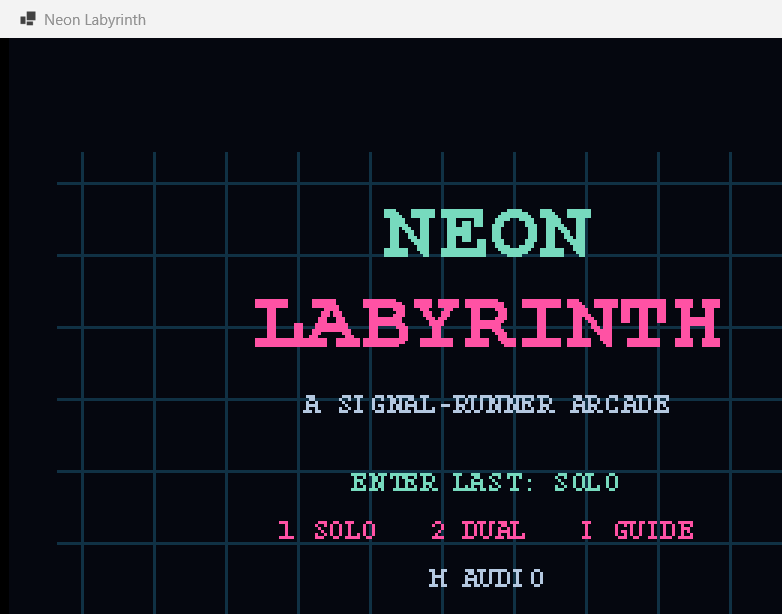

# Neon Labyrinth

Neon Labyrinth is an original fixed-screen retro maze shooter for one or two
local players. Signal runners clear escalating defense grids with directional
pulse fire while six behaviorally distinct constructs roam, pursue, predict,
evade firing lanes, surge, and flee.

The title, terminology, rules, maze, graphics, effects, and synthesized audio
are original. The project uses C#/.NET 10 and Windows Forms without a game
engine or runtime dependency in the packaged release.



## Features

- Complete solo and local cooperative survival loops
- Fixed 60 Hz deterministic simulation and crisp 320x240 logical framebuffer
- Responsive buffered corridor movement and simultaneous keyboard input
- Drifter, Tracer, Vector, Veil, Surge, and rare Prism behaviors
- Escalating cycles, individual scores, chains, lives, safe respawns, and game over
- No co-op friendly fire; survivor progression and teammate cycle recovery
- Versioned top-10 high scores and settings under `%LOCALAPPDATA%\NeonLabyrinth`
- Six original programmatically synthesized sound cues
- High-contrast and reduced-flash accessibility modes
- Optional F3 performance/game-state diagnostics and bounded lifecycle logging

## Controls

| Action | Player 1 | Player 2 |
|---|---|---|
| Move | W, A, S, D | Arrow keys |
| Fire | Space | Enter or Right Control |

| System action | Key |
|---|---|
| Start last mode | Enter on title |
| Start solo / co-op | 1 / 2 on title |
| Instructions | I on title |
| Pause / resume | P or Escape |
| Restart while paused | R |
| Return to title while paused | Q |
| Mute | M |
| High contrast | F2 |
| Diagnostics | F3 |
| Reduced flashes | F4 |

Qualifying game-over scores prompt for a 1-8 character callsign. Backspace
edits it and Enter saves it.

## Build, test, and run

Requirements for development are Windows 10 or later (x64) and .NET SDK
10.0.300 or a compatible .NET 10 patch SDK.

```powershell
powershell -NoProfile -ExecutionPolicy Bypass -File .\scripts\build.ps1
powershell -NoProfile -ExecutionPolicy Bypass -File .\scripts\test.ps1
powershell -NoProfile -ExecutionPolicy Bypass -File .\scripts\run.ps1
```

Direct equivalents are `dotnet build`, `dotnet test`, and:

```powershell
dotnet run --project .\src\MazeHunter.Game\MazeHunter.Game.csproj
```

## Create the release

```powershell
powershell -NoProfile -ExecutionPolicy Bypass -File .\scripts\package.ps1 -Version 1.0.0
```

This creates the self-contained, single-file Windows x64 release at
`artifacts\NeonLabyrinth-1.0.0-win-x64\NeonLabyrinth.exe`. The packaged game
does not require a separately installed .NET runtime or administrator rights.

## Project documentation

- [Game design](docs/GAME_DESIGN.md)
- [Architecture](docs/ARCHITECTURE.md)
- [Roadmap](docs/ROADMAP.md)
- [Testing](docs/TESTING.md)
- [Development log](docs/DEVELOPMENT_LOG.md)
- [Changelog](CHANGELOG.md)
